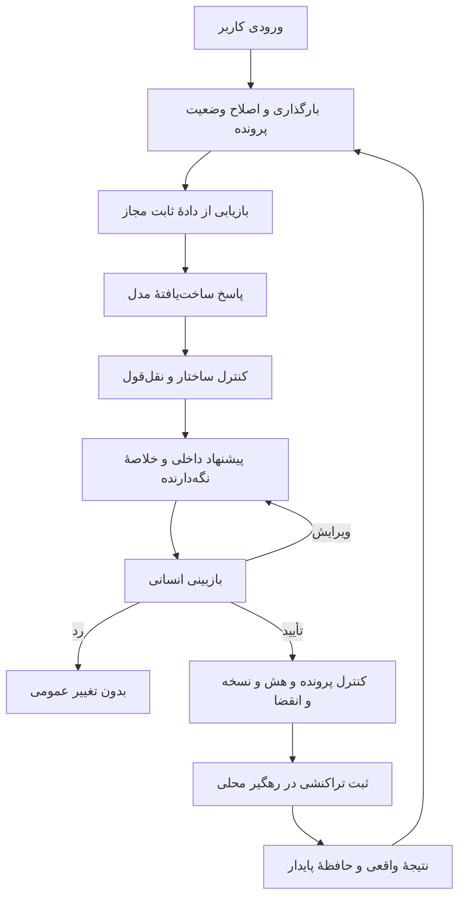

# معماری و دلیل انتخاب‌ها

هدف: دستیار یک پرونده را با شواهد قابل بررسی پیش ببرد؛ پاسخ مناسب می‌تواند راهنمایی، پرسش تمایزدهنده یا ارجاع باشد. بسته‌شدن، معیار عمومی موفقیت نیست.

طراحی: یک عامل محدود با پنج مرحله، یک فراخوانی مدل و ابزارهای کوچک انتخاب شده است. این ساختار در بودجهٔ محدود قابل اندازه‌گیری و عیب‌یابی است. چندعامل و پایگاه برداری بیرونی برای بخش اصلی لازم نبودند.

حافظه: شناسهٔ هر پرونده جداست. وضعیت شامل واقعیت‌ها، سابقهٔ اصلاح، بررسی‌های انجام‌شده، پیام‌ها، منابع، پیشنهاد در انتظار و نتیجهٔ اقدام‌هاست. مقدار نامشخص در فهرست واقعیت‌ها ساخته نمی‌شود. استخراج اولیهٔ خودکار فقط برای نسخه‌های صریح و بدون تعارض انجام می‌شود؛ اطلاعات کامل‌تر از پیام و ورودی ساخت‌یافته در دسترس‌اند.

بازیابی: روش پایه امتیاز واژگانی است. روش نهایی امتیاز واژه و سه‌نویسه را با ادغام رتبه ترکیب می‌کند، دامنه را از عنوان قابل مشاهده تشخیص می‌دهد، سه جایگاه برای مستندات رسمی نگه می‌دارد و تنوع منبع را رعایت می‌کند. منابع ناسازگار با نسخه پایین‌تر می‌آیند، اما تفاوت نسخه همیشه حذف قطعی نیست؛ دادهٔ قدیمی می‌تواند برای تشخیص نیاز به بررسی مفید باشد. این تطبیق، حل‌کنندهٔ کامل محدودهٔ نسخه نیست.

استناد: مدل تنها شناسه و نقل‌قول از بستهٔ شاهد را برمی‌گرداند؛ نشانی و نسخه از فرادادهٔ ثابت به پاسخ افزوده می‌شوند. نقل‌قول جعلی یا شناسهٔ بیرون بسته، پاسخ را به ارجاع تبدیل می‌کند. توضیح و فرضیهٔ مدل شاهد قطعی محسوب نمی‌شوند و بازبین باید رابطهٔ معنایی آن‌ها را بسنجد.

مجوز: تأیید به شناسهٔ پرونده، شناسهٔ پیشنهاد، هش محتوا و شمارهٔ نسخهٔ وضعیت متصل است و پانزده دقیقه اعتبار دارد. پیشنهاد تازه، اصلاح محتوا، اطلاعات تازه یا جابه‌جایی پرونده اجازهٔ استفاده از مجوز قبلی نمی‌دهد. توکن نقش بازبین با توکن اپراتور جداست. ادعای نقش یا تأیید در بدنهٔ درخواست پذیرفته نمی‌شود.

اجرا: نظر، وضعیت و برچسب در یک تراکنش پایگاه داده ثبت می‌شوند. شناسهٔ پیشنهاد کلید اجرای یک‌باره است. اگر ثبت انجام و پاسخ گم شود، همان درخواست نتیجهٔ ذخیره‌شده را برمی‌گرداند. خرابی پیش از ثبت، هیچ تغییر ناقصی باقی نمی‌گذارد. بستن پرونده به واقعیت صریح تأیید رفع نیاز دارد.

توقف: پس از یک درخواست مدل، پاسخ بررسی و پیشنهاد ساخته می‌شود؛ حلقهٔ بازگشتی پنهان وجود ندارد. سقف اندازهٔ پیام، تعداد نوبت، اندازهٔ شاهد و تعداد اقدام در کد اعمال می‌شود. در کمبود بودجه یا خطای درگاه، درخواست جدید خودکار تکرار نمی‌شود و وضعیت حفظ می‌شود.

رابط: برنامهٔ اصلی با خط فرمان و رابط فارسی قابل نمایش است. گردش‌کار سایت فقط درخواست‌های سه مسیر ثابت را به همین برنامه منتقل می‌کند. تأیید انسانی در مسیر جدا می‌ماند؛ متن مدل نمی‌تواند نشانی ابزار یا اعتبارنامه را عوض کند.

محدودیت: سرور نمونه برای نمایش و کار گروهی محدود طراحی شده است؛ برای میزبانی اینترنتی باید پشت نشانی امن، کنترل دسترسی و ذخیره‌سازی پایدار اجرا شود. تنظیم این میزبانی روی سایت کاربر در این مرحله انجام نشده است.
