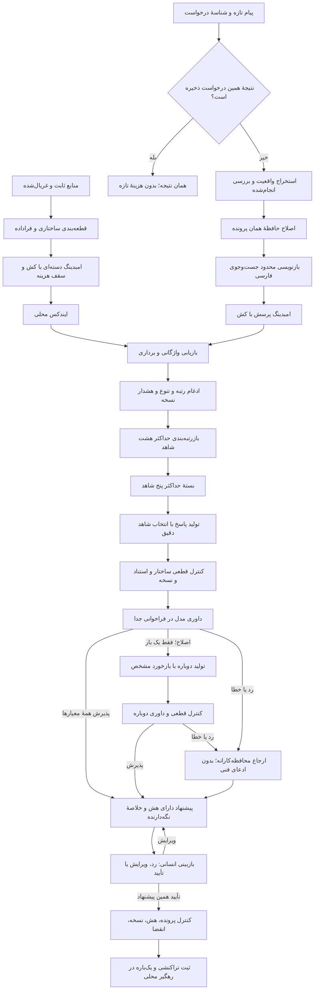

# معماری دوم و تطبیق با تمرین‌ها

وضعیت: مسیر پیش‌فرض برنامه معماری دوم است. پیاده‌سازی و نتایج معماری اول برای بررسی تاریخی حفظ شده‌اند؛ اعداد ارزیابی قبلی، ارزیابی معماری تازه نیستند. جزئیات قابل اجرا در `pipeline.py`، قرارداد نقش‌ها در `roles.py` و نوت‌بوک پروژه آمده‌اند.

مرحلهٔ داده: ایندکس از فهرست منابع مجاز نسخهٔ اول ساخته می‌شود. پرونده‌های ارزیابی، نظرهایشان، خانواده‌های مرتبط و بندهای حاوی پاسخ مستقیم همچنان بیرون بازیابی‌اند. فایل‌های قدیمی بازنویسی نمی‌شوند. فایل `corpus_v2.json` و صورت‌جلسهٔ `index_v2_manifest.json` هش و منشأ مستقل دارند.

مرحلهٔ قطعه‌بندی: عنوان و مرز بخش، خط اصلی، نسخه، شناسهٔ منبع و هش حفظ می‌شوند. بلوک کد و جدول یکپارچه می‌مانند. هم‌پوشانی در سطح بلوک و داخل همان بخش انجام می‌شود. سقف هدف ۱۶۰۰ و هم‌پوشانی ۲۵۶، بر اساس شمار بایت به‌عنوان تخمین محافظه‌کارانهٔ توکن است؛ شمارش توکن واقعی مدل نیست. بلوک اتمی بزرگ با پرچم مشخص حفظ می‌شود و اگر در بستهٔ شاهد جا نگیرد، کامل کنار گذاشته می‌شود.

مرحلهٔ امبدینگ: حالت زنده امبدینگ یادگرفته‌شدهٔ متیس را می‌گیرد. متن تکراری پیش از درخواست حذف و ورودی‌ها با محدودیت تعداد و اندازه دسته‌بندی می‌شوند. کش بر اساس متن نرمال‌شده و هویت مدل و تنظیمات است. هزینهٔ ساخت ایندکس، پرسش و درخواست ناموفق در دفتر مشترک تیم می‌ماند. هنگام پاسخ‌گویی ساخت کامل ایندکس ممنوع است؛ ایندکس آماده نباشد، مسیر به ارجاع امن می‌رود. تغییر متن یا مدل فقط دادهٔ لازم را دوباره محاسبه می‌کند.

مرحلهٔ بازیابی: امتیاز `BM25` و شباهت کسینوسی بردار با `RRF` و ثابت ۶۰ ترکیب می‌شوند. انتخاب متنوع با `MMR` و ضریب ۰٫۷، حداکثر دو چانک از یک منبع را نگه می‌دارد. نسخهٔ متفاوت جریمه و صریح علامت‌گذاری می‌شود؛ نبود نسخه به معنی سازگاری نیست. مقایسهٔ دامنهٔ نسخه یا تاریخ معرفی تمام توابع پیاده نشده است؛ داور باید این عدم قطعیت را رعایت کند. ادعای قطعی با شاهد دارای نسخهٔ متفاوت از دروازهٔ قطعی عبور نمی‌کند.

مرحلهٔ بازرتبه‌بندی: حداکثر هشت نامزد با پیام کاربر، اطلاعات تازه و بررسی‌های قبلی به فراخوانی جدا می‌روند. خروجی تنها ترتیب شناسه‌های همان نامزدهاست. شناسهٔ بیگانه، تکراری یا خروجی خالی به ترتیب اولیه برمی‌گردد و خطا در ردپا ثبت می‌شود؛ شناسهٔ ساختگی اصلاح یا حدس زده نمی‌شود. بستهٔ نهایی حداکثر پنج شاهد و ده هزار بایت متن دارد.

مرحلهٔ حافظه: استخراج فقط با نقل‌قول صریح از پیام تازه پذیرفته می‌شود. مقایسهٔ چند نسخه به انتخاب دلخواه یکی از آن‌ها منجر نمی‌شود. اطلاعات ساخت‌یافتهٔ کاربر بر استخراج مدل اولویت دارد. استخراج نمی‌تواند تأیید، مجوز یا رفع قطعی مشکل بسازد. چک‌های انجام‌شده و متن اولیه همراه اطلاعات تازه به تولیدکننده و داور داده می‌شوند. پیام‌های طولانی با پرچم کوتاه‌سازی محدود می‌شوند؛ حافظهٔ کامل در رهگیر باقی می‌ماند.

مرحلهٔ تولید: مدل شناسهٔ منبع و قطعهٔ نقل‌قول را انتخاب می‌کند و برنامه متن اصلی را درج می‌کند. شناسهٔ بیرون بسته و نقل‌قول ناموجود رد می‌شوند. پاسخ می‌تواند راهنمایی، پرسش تمایزدهنده یا ارجاع باشد. گزارش مشابه به معنی علت مشترک یا رفع‌شدن خطا نیست.

مرحلهٔ داوری: داور در فراخوانی جدا، ارتباط شاهد، حمایت از ادعا، سازگاری نسخه، فایدهٔ قدم بعد، تکراری‌نبودن سؤال و مقاومت در برابر دستورهای تزریقی را بررسی می‌کند. تمام معیارها باید دو و یافته‌ها خالی باشند. کنترل قطعی با برچسب پذیرش مدل دور زده نمی‌شود. اصلاح حداکثر یک بار و با داوری دوباره است. رد دوباره، خطا، کمبود بودجه یا پایان مهلت به ارجاع امن می‌رسد. متن دستور و معیار در `judge_rubric.json` منتشر شده است.

مرز استقلال: پیش‌فرض، داور همان نوع مدل را در فراخوانی جدا استفاده می‌کند؛ زمینهٔ نقش آن از تولید جداست. مدل داور متفاوت با تنظیم مدل و تعرفهٔ جدا پشتیبانی می‌شود. هیچ‌کدام داوری مستقل انسانی یا اثبات صحت پاسخ نیست. مقایسهٔ داور و انسان باید روی همان پاسخ‌های معماری دوم انجام شود؛ فرم هوش مصنوعی نسخهٔ اول جای آن نیست.

مرحلهٔ مجوز: مدل‌ها فقط خواندن و پیشنهاد دارند. تأیید انسانی جدا از داور مدل است و به پرونده، شناسه و هش پیشنهاد، نسخهٔ وضعیت و مهلت پانزده‌دقیقه‌ای وابسته می‌ماند. ویرایش یا پیام تازه، مجوز قبلی را نامعتبر می‌کند. ثبت فقط در رهگیر محلی و در تراکنش انجام می‌شود. تلاش مجدد پس از قطع ارتباط همان اثر ذخیره‌شده را برمی‌گرداند.

مرحلهٔ هزینه: سقف سخت هر نوبت هشت فراخوانی شامل امبدینگ پرسش، چهار سنت و ۱۸۰ ثانیه است. سقف عملیاتی پیش‌فرض متیس نیم دلار تجمعی و سقف نهایی تیم پنج دلار است. رزرو پیش از درخواست انجام می‌شود؛ هزینهٔ نامعلوم آزاد یا صفر فرض نمی‌شود. برای آزمایش تازه، ساخت ایندکس هشت سنت و دو پروندهٔ توسعه هفت سنت سقف جدا دارند. اصابت کش درخواست شبکه ندارد.

مرحلهٔ گردش‌کار: فایل سایت سه مسیر مستقل نوبت، بازبینی انسانی و اجرا را نگه می‌دارد. نقش‌های مدل و بازیابی در هستهٔ پایتون اجرا می‌شوند تا دفتر هزینه و مرز مجوز واحد بماند. گره کنترل قرارداد، نبود داوری پذیرفته‌شده یا ارجاع امن را رد می‌کند. کلید مدل در فایل سایت یا مرورگر قرار ندارد. واردکردن و اجرای سایت کاربر هنوز مرحلهٔ جداست.

تطبیق تمرین‌ها: اصول هفتهٔ سوم شامل چانک ساختاری، فراداده، کش، بازیابی ترکیبی، ادغام رتبه، تنوع، بازرتبه‌بندی محدود و کنترل استناد اعمال شده‌اند. اصول هفتهٔ چهارم شامل جدایی تولید و داوری، اصلاح محدود و توقف مشخص‌اند. اصول ابزارها و حافظه شامل قرارداد ورودی، دادهٔ نامطمئن، نقش‌های مجزا، اصلاح واقعیت، مجوز محدود و اجرای یک‌باره حفظ شده‌اند. روش‌های مربوط به مسائل دیگر تمرین‌ها، مانند یادگیری تقویتی، جزء این گردش‌کار پشتیبانی فنی نیستند.

مرحلهٔ ارزیابی: نسخهٔ اصلاح‌شده روی پنج پروندهٔ توسعهٔ هدفمند و پانزده آزمون تازه، با 40 مقایسهٔ پردازش‌شده و 10 سناریوی عملیاتی سنجیده شد؛ تعداد سناریوی موفق 8 است. مقایسهٔ زوجی تازه در بازبینی این دستیار، 7 بهتر، 8 برابر و 0 بدتر دارد. نسخهٔ جدید امتیاز کلی صفر 0، یک 15 و دو 0 دارد. تعداد 14 پاسخ از پانزده به ارجاع عمومی رسیدند؛ فایده هنوز کافی نیست. ارجاع امن، حل مسئله محسوب نمی‌شود. گزارش [اصلاح کیفیت](QUALITY_REVISION_FA.md) و [یافته‌ها](QUALITY_FINDINGS_FA.md) مرجع جاری‌اند؛ گزارش‌های معماری‌های قبلی تاریخی حفظ شده‌اند. داوری مستقل انسانی و آزمون سایت باقی‌اند.
مرحلهٔ اصلاح کیفیت: برنامهٔ تشخیص در همان استخراج، حفظ گزارش و اصلاحات، فیلتر منابع اداری، جست‌وجوی فنی کوتاه، سؤال تازه و ممیزی ادعا و شاهد اضافه شده‌اند. شرح قراردادها و محدودیت‌ها در [پیاده‌سازی اصلاح کیفیت](QUALITY_IMPLEMENTATION_FA.md) است. کنترل قطعی و پذیرش مدل صحت کامل معنا را تضمین نمی‌کنند.
